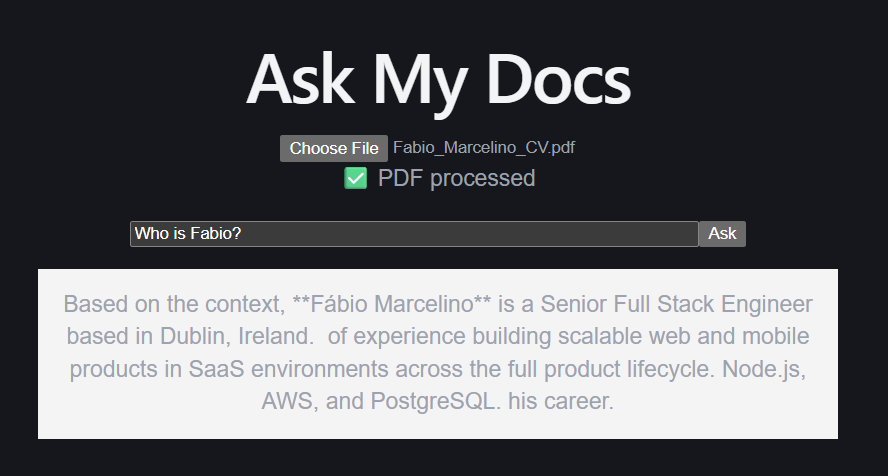

# Ask My Docs

Chat with your PDFs. Upload a document, ask questions in natural language, and get grounded answers — streamed in real time.

**Live demo:** https://ask-my-docs-eight.vercel.app



## How it works

1. Upload a PDF → the text is extracted, split into overlapping chunks, and embedded into a vector database
2. Ask a question → the most relevant chunks are retrieved with vector similarity search (pgvector) and injected into the LLM context
3. The answer streams back token by token (SSE)

## Architecture

```
React (Vite + TypeScript)
        │  REST + SSE
        ▼
FastAPI (Python)
        │
        ├──▶ PostgreSQL + pgvector  (chunk storage + similarity search)
        └──▶ Gemini API             (embeddings + chat, streaming)
```

## Tech stack

| Layer | Tech |
|---|---|
| Frontend | React 19, TypeScript, Vite |
| Backend | Python, FastAPI |
| Database | PostgreSQL + pgvector (Neon) |
| AI | Gemini API (chat completions + embeddings, OpenAI-compatible) |
| Observability | Sentry (error monitoring + tracing) |
| CI/CD | GitHub Actions (automated tests on every push) |
| Deploy | Railway (API) · Vercel (frontend) |

## Features

- **RAG pipeline**: PDF parsing → chunking with overlap → embeddings → semantic retrieval → grounded answers
- **Streaming responses** over Server-Sent Events (SSE)
- **Error handling**: global exception handlers; every error is reported to Sentry with full stack traces
- **CI**: tests run on every push via GitHub Actions

## Run locally

```bash
pip install -r requirements.txt
# set env vars: GEMINI_API_KEY, GEMINI_BASE_URL, GEMINI_MODEL_NAME, DATABASE_URL, SENTRY_DSN
uvicorn main:app --reload

cd frontend && npm install && npm run dev
```

Open http://localhost:5173